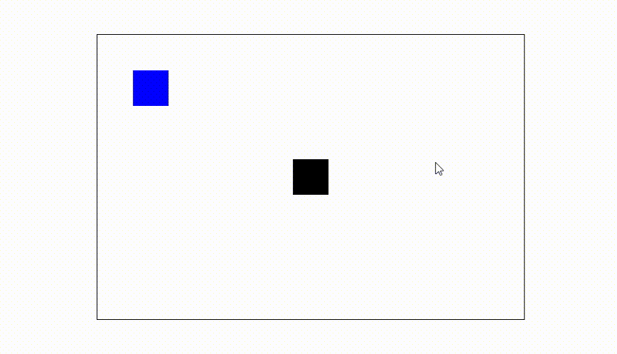

<h1 align = "center">Canvas - Collision</h1>

    

<h2 align = "center">Criado usando as tecnologias</h2>

 

Link:
    <a href = "https://www.youtube.com/watch?v=k887x45_R4w&list=PLclUTiUoLCbAHv7L2x4BzHdWRmhv1Hs63&index=1&t=37s">
    collision
    </a>

